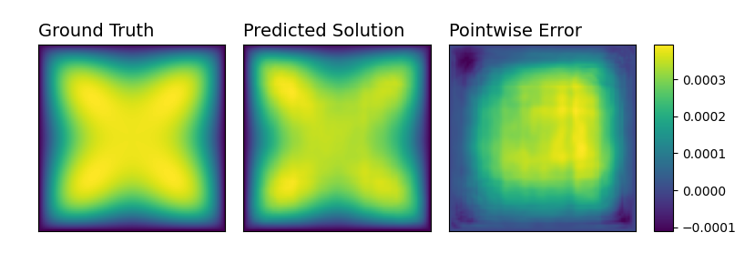

# Synthetic data for operator learning 

This is a demo implementation of the paper [Generating synthetic data for neural operators](https://arxiv.org/abs/2401.02398).

## Introduction 

This is a synthetic data library used in neural operators for elliptic PDE problems that overcomes dependence on classical solvers such as finite differences, finite element, etc.  

 

The class of problems we consider are of the form $-L_au = f$ on square domains with Dirichlet or Neumann boundary conditions, where $L_a$ denotes an elliptic differential operator with dependence on some parameter $a$. 

 

The idea is simple: we first generate the unknown function $u$ then plug it into $-L_a u = f$ to compute $f$ and produce the input pair $(f,a)$ with output target $u$.  

 

The main difficulty is to construct representative functions $u$ so that they generalize well when tested against any new input pair $(f,a)$. For more details on how to pick the $u$ functions see our paper: [arxiv.org/abs/2401.02398](https://arxiv.org/abs/2401.02398).

 

## Example using FNO 

As a simple example consider the Poisson equation $-\Delta u = f$ in $\Omega:=(0,1)^2$ with zero Dirichlet boundary conditions. For this problem we take $u$ to be the truncated series of the form $$u=\sum_{i=0}^N c_i u_i$$ where $c_i$'s are random coefficients and the $u_i$'s are basis functions for the space of solutions to the problem known as the Sobolev space and is denoted by $H_0^1(\Omega)$. The $u_i$'s are known for square domains and consist of sine functions appropriately scaled.  

 

Below we demonstrate the performance of FNO (see [neuraloperator](https://github.com/neuraloperator/neuraloperator)) being trained with $100,000$ training data of sine functions and test on the unseen function $f(x,y)=|x-0.5||y-0.5|$ which isn't even differentiable everywhere on $(0,1)^2$. 

 

<p float="left"> 

   

</p> 

 


## Installation and citation 

This library depends on NumPy, PyTorch and the [SymEngine](https://github.com/symengine/symengine.py) python wrapper to symbolically generate functions and take derivatives before evaluating them pointwise on grids. To get started, one can clone this 

 

``` 
git clone https://github.com/erisahasani/synthetic-data-for-neural-operators 
cd synthetic-data-for-neural-operators 
``` 

 
For more details on this work, refer to:  

```
@misc{hasani2024generating,
      title={Generating synthetic data for neural operators}, 
      author={Erisa Hasani and Rachel A. Ward},
      year={2024},
      eprint={2401.02398},
      archivePrefix={arXiv},
      primaryClass={cs.LG}
    }
``` 